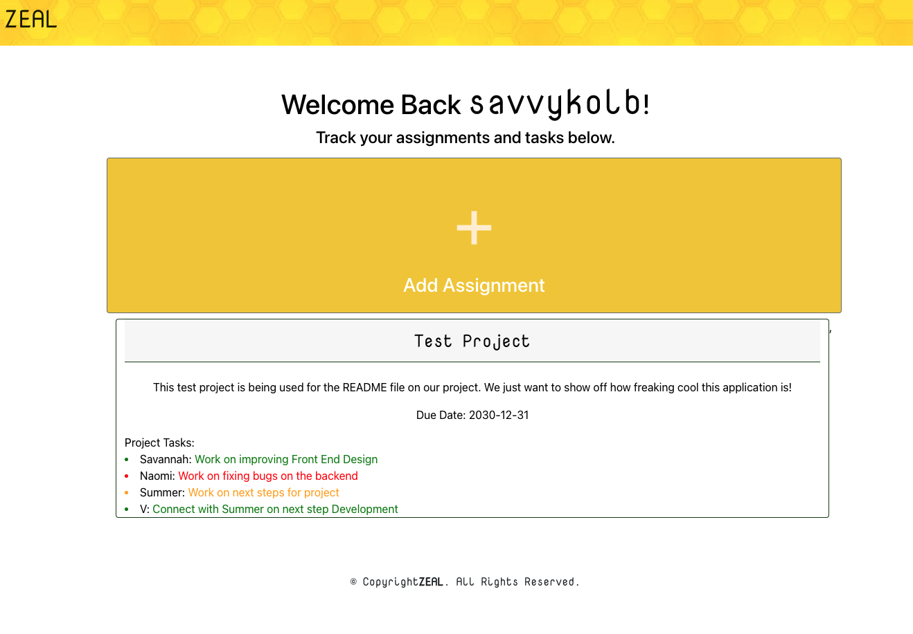

# ZEAL

An application created by a teacher with the goal to help grow students’ leadership, delegation, and organizational skills while easing the stress of group projects. What better way to grow a student’s initiative than by mixing a cool new app that increases the opportunity for working with friends!
 

# Links

[ZEAL](https://zeal3.herokuapp.com/)

[GitHub](https://github.com/snk923/ZEAL)

### Login Screen
#

When the user first enters the application, they will see a well polished and inviting login screen with the option to log in or to create an account.

### Homepage
#

Once logged in, users will see their username displayed at the top of the screen welcoming them into their site. If they are a previous user, the will see all their projects displayed on this screen. If they are a new user, they will be prompted to create a new project. 

### Create New Assignment
#

Once users click on the 'Add Assignment' button, they will be taken to a form that allows them to customize a new project.

### Assign Tasks 
#

Once a project is created, users can now delegate tasks to team members on the project. They can also designate whether the task is high priority, medium priority, or low priority. 

### Future Developments 
#

Currently, the development team is working on completing the 'update' portion of our CRUD method. We are also working on fixing our back end bugs, as well as any front end bugs that are persisting. In the future, we would like to add additional features to our application to allow it to be more interactive and have multiple user levels.  

# Development Team

[Savannah Kolb](https://github.com/snk923)

[Naomi Torres-Serrano](https://github.com/NaomiTS)

[Summer Milner](https://github.com/SummerElise)

[Naomi Valdovinos Flores](https://github.com/Nvaldovinos)

[Fatimah Grant](https://github.com/Fatimah2014)